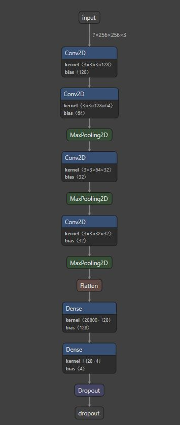

# Tensorflow multi-class Image Classifier
*  Created own dataset by writing Image Scrapper using selenium.
*  Scrapped image data used to create Convolution Neural Network using Tensorflow for Keras.
* Adding simple Object-oriented Programming (OOP) principle to deep learning workflow (Here is the Notebook).

### Visualization of model using Netron app

